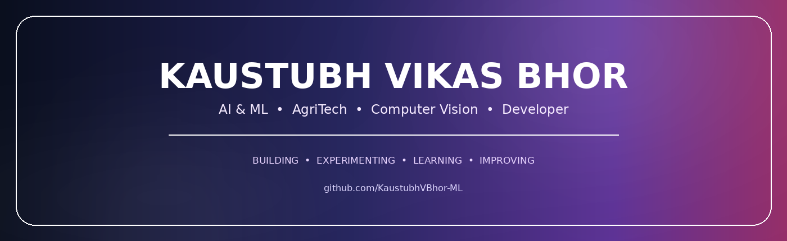

<div align="center">



<br/>


</div>

---

<div align="center">

</div>

## 👨‍💻 About Me

Hi, I'm **Kaustubh Vikas Bhor** — an **AI & Machine Learning Diploma Student** passionate about building intelligent, practical, and impactful technology.

I’m particularly interested in the intersection of **Artificial Intelligence, Machine Learning, Computer Vision, and Agriculture**. My goal is to develop technology that can solve real-world problems and contribute to the future of **Agri-Tech**.

### 🚀 What I Do

- 🤖 Build **AI & Machine Learning** projects
- 🌱 Explore **AI-powered Agriculture & Agri-Tech** solutions
- 👁️ Work with **Computer Vision & Image Classification**
- 🌐 Develop modern **Web Applications & AI-powered systems**
- 🧠 Continuously improve my skills through projects and experimentation
- 🔬 Turn real-world problems into **technology-driven solutions**

### 🎯 My Vision

> **“Building intelligent technology for a smarter and more sustainable future.”**

I aim to combine **AI + Agriculture + Innovation** to create solutions that can make farming more efficient, data-driven, and accessible.

### 💡 Currently Exploring

**Machine Learning • Deep Learning • Computer Vision • AI • Python • Flask • Data Science • Agri-Tech • Intelligent Systems**

---

<div align="center">

</div>

# 🚀 Projects

<table width="100%">
<tr>
<td width="25%" valign="top">

### 🌾 AI Irrigation

**AI-Powered Smart Irrigation Decision System**

Intelligent irrigation decision support using crop, soil and weather inputs.

`AI / ML` `AgriTech` `Python` `Flask`

[**View Project →**](https://github.com/KaustubhVBhor-ML/AI-Powered-Smart-Irrigation-Decision-System)

</td>
<td width="25%" valign="top">

### 🚚 Bhor Roadlines

**Business Website**

Modern responsive website focused on professional business presentation and web development.

`HTML` `CSS` `JavaScript` `Web`

[**View Project →**](https://github.com/KaustubhVBhor-ML/Bhor-Roadlines-website)

</td>
<td width="25%" valign="top">

### 💼 My Portfolio

**Personal Portfolio Website**

A modern portfolio for showcasing projects, skills, learning journey and technical work.

`HTML` `CSS` `JavaScript` `Frontend`

[**View Project →**](https://github.com/KaustubhVBhor-ML/my-portfolio)

</td>
<td width="25%" valign="top">

### 🧠 ML Mini Projects

**Machine Learning Project Collection**

A collection of practical ML experiments covering model building, data analysis and experimentation.

`Python` `Scikit-learn` `Jupyter` `ML`

[**View Project →**](https://github.com/KaustubhVBhor-ML/machine_learning_mini_projects)

</td>
</tr>
</table>

---

<div align="center">

</div>

## 🛠️ Technology Stack

<table width="100%">
<tr>
<td width="25%" align="center" valign="top">


**Python**  
Core language for AI, ML, automation and application development.

</td>
<td width="25%" align="center" valign="top">


**HTML • CSS • JavaScript**  
Building responsive, interactive and modern web interfaces.

</td>
<td width="25%" align="center" valign="top">


**TensorFlow**  
Deep learning and neural-network experimentation.

</td>
<td width="25%" align="center" valign="top">


**Computer Vision**  
Image processing, classification and vision-based applications.

</td>
</tr>
<tr>
<td width="25%" align="center" valign="top">


**Scikit-learn**  
Classical machine learning models and data workflows.

</td>
<td width="25%" align="center" valign="top">


**Jupyter**  
Data analysis, experiments, notebooks and model prototyping.

</td>
<td width="25%" align="center" valign="top">


**Git • GitHub**  
Version control, project management and public development workflow.

</td>
</tr>
</table>

---

<div align="center">

</div>

# 💼 GitHub Involvement

**📦 Building** — Practical AI/ML, AgriTech, web and portfolio projects.

**🧪 Experimenting** — Mini-projects and technical experiments to learn by implementation.

**🔄 Iterating** — Improving code, interfaces, features and project presentation.

**📚 Learning in Public** — Keeping projects and progress visible through GitHub.

**🤝 Collaborating** — Growing toward open-source and collaborative engineering.

---

<div align="center">

</div>

# 🧭 Development Roadmap

```text
📚 LEARN
   ↓
💻 BUILD
   ↓
🧪 EXPERIMENT
   ↓
🔧 IMPROVE
   ↓
🚀 SHIP
   ↓
🌍 IMPACT
```

---

# 🌱 Current Direction

| Area | Direction |
|:---|:---|
| 🤖 AI / ML | Stronger practical implementations |
| 🌾 AgriTech | Intelligent solutions for agriculture |
| 👁️ Computer Vision | Vision-based applications |
| 🌐 Web | Better interfaces and interactive experiences |
| 🧠 Problem Solving | Stronger fundamentals through projects |
| 🤝 Open Source | Collaboration and contribution |

---

# 🌐 Connect With Me

<div align="center">

<a href="https://github.com/KaustubhVBhor-ML"></a>
<a href="https://kaustubhvbhor-ml.github.io/my-portfolio/"></a>
<a href="mailto:bkaustubh0997@gmail.com"></a>
<br/><br/>

**GitHub:** [KaustubhVBhor-ML](https://github.com/KaustubhVBhor-ML)  
**Portfolio:** [kaustubhvbhor-ml.github.io/my-portfolio](https://kaustubhvbhor-ml.github.io/my-portfolio/)  
**Email:** [bkaustubh0997@gmail.com](mailto:bkaustubh0997@gmail.com)

</div>

---

<div align="center">


### ✦ Build with purpose • Learn by doing • Improve every iteration ✦

</div>
